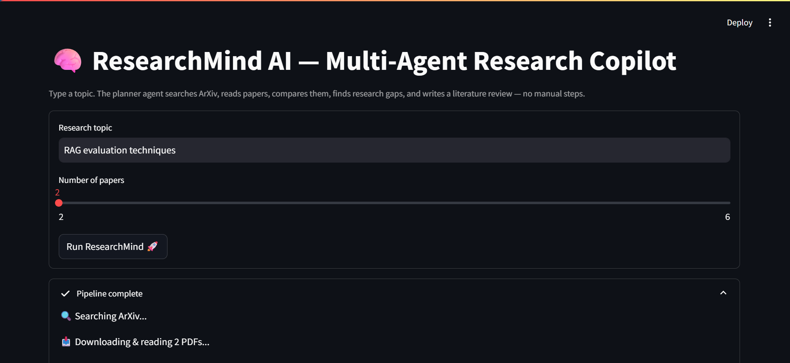

# 🧠 ResearchMind AI
### Multi-Agent Research Copilot

*Give it a topic. A planner agent searches, reads, compares, and writes the literature review — no manual steps.*

[](https://researchmind-ai-geti.onrender.com)
[](https://www.python.org/)
[](https://streamlit.io/)
[](https://fastapi.tiangolo.com/)
[](https://groq.com/)
[](#license)

**🔗 [Live Link](https://researchmind-ai-geti.onrender.com)**

</div>

---

## 📸 Preview

> 

## 💡 What it does

Most fresher AI portfolios have a PDF chatbot or a resume screener. This one is different — it's an **agentic system**, not a Q&A bot. Give it one research topic and a **planner agent** decides and runs the full task sequence on its own:

```
"Research RAG evaluation techniques"
        │
        ▼
 Planner Agent  ──▶  decides the task list, no human in the loop
        │
        ├── 🔍 Search Agent        → finds relevant papers on ArXiv
        ├── 📥 PDF Agent            → downloads & extracts full text
        ├── 🧠 Summary Agent         → structured per-paper summary (LLM)
        ├── 📊 Comparison Agent       → builds a cross-paper table
        ├── 🕳️ Gap Agent               → finds what's NOT been studied yet
        ├── 📝 Report Writer Agent      → writes a literature review
        └── 📄 Report Agent               → exports everything as PDF
```

The user never says "now search," "now summarize," "now compare." **The planner decides everything** — that's what makes it agentic, not scripted.

## 🎯 Why this project stands out

| Typical fresher project | ResearchMind AI |
|---|---|
| Single-turn Q&A over one document | Multi-step reasoning over *several* documents at once |
| Fixed pipeline, hardcoded order | Planner decides task sequence dynamically |
| "Chat with a PDF" | Plans → searches → reads → compares → critiques → writes |
| No cross-document reasoning | Research Gap Agent reasons across ALL papers together |

## 🏗️ Architecture

```
backend/
├── main.py                      FastAPI app (/research, /research/report, /health)
└── agents/
    ├── planner.py                orchestrator — the "brain"
    ├── search_agent.py           ArXiv search
    ├── pdf_agent.py               download + pdfplumber text extraction
    ├── summary_agent.py           per-paper structured JSON summary (LLM)
    ├── comparison_agent.py         cross-paper table (pure formatting, no LLM)
    ├── gap_agent.py                 reasons across ALL summaries together (LLM)
    ├── report_writer_agent.py        literature review write-up (LLM)
    └── report_agent.py                PDF export (fpdf2)
frontend/
└── app.py                       Streamlit UI — tabs for papers / comparison / gaps / review
```

Every agent is a plain Python function that calls one shared LLM wrapper (`backend/utils/llm.py`), so swapping models or adding real MCP tool servers later touches one file, not the whole pipeline.

## 🛠️ Tech stack

`Python` `FastAPI` `Streamlit` `Groq (Llama 3.3 70B)` `ArXiv API` `pdfplumber` `fpdf2`

## 🚀 Deployment

Deployed as a single Streamlit web service on **Render** (free tier).

- **Build:** `pip install -r requirements.txt`
- **Start:** `streamlit run frontend/app.py --server.port=$PORT --server.address=0.0.0.0`
- **Env vars:** `GROQ_API_KEY`, `GROQ_MODEL`, `PYTHON_VERSION=3.11.9`
  *(pinned because Render's default Python 3.14 has no prebuilt wheel yet for `pydantic-core`, which then fails to compile without a Rust toolchain)*
- **Uptime monitoring:** UptimeRobot checks every 5 minutes and alerts on downtime.

## ⚙️ Run locally

```bash
git clone https://github.com/AtinChoudhary06/researchmind-ai.git
cd researchmind-ai

python -m venv venv
source venv/bin/activate        # Windows: venv\Scripts\activate
pip install -r requirements.txt

cp .env.example .env            # add your free Groq key from console.groq.com

streamlit run frontend/app.py
```

Optional — run the API separately:
```bash
uvicorn backend.main:app --reload --port 8000
# Swagger docs at http://localhost:8000/docs
```

## 📡 API

```
POST /research
{ "topic": "RAG evaluation techniques", "max_papers": 4 }

POST /research/report   → returns a downloadable PDF report
GET  /health
```

## 🗺️ Roadmap

- [x] **Phase 1** — Planner, ArXiv search, PDF read, summaries, comparison table, research gaps, literature review, PDF export. **Deployed.**
- [ ] **Phase 2** — Session history, Markdown export, semantic search across downloaded papers (embeddings + vector store)
- [ ] **Phase 3** — Swap direct API calls for real MCP servers (ArXiv MCP, Filesystem MCP), add Notion MCP for auto-saved notes, Browser MCP for latest blogs/repos, citation agent (APA/IEEE/BibTeX)

## 👤 Author

**Atin Choudhary** — B.Tech IT, Global Institute of Technology, Jaipur
[GitHub](https://github.com/AtinChoudhary06)

## License

MIT
